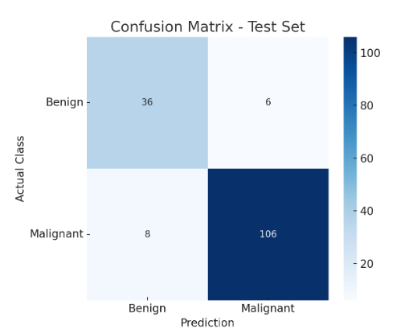

# Classification of Medical Images Using ResNet Architecture on the BreastMNIST Dataset

## Project Description

This project explores the application of deep learning in medical diagnostics, specifically focusing on the classification of breast ultrasound images into benign and malignant categories using the ResNet50 architecture. Images for this project were obtained from the BreastMNIST dataset, part of the MedMNIST v2 collection. Model training and evaluation were performed entirely in Google Colab.

## Dataset

- Name: BreastMNIST (224x224 grayscale images)
- Classes: Benign (0), Malignant (1)
- Total Samples: 780 (Train: 546, Validation: 78, Test: 156)
- Challenge: Class imbalance - significantly more malignant cases

## Methodology

- Model: ResNet50 with transfer learning and fine-tuning
- Loss Function: Focal Loss
- Optimizer: Adam

## Training and Evaluation Flow

- Preprocessing: Normalization, augmentation and grayscale handling
- Training: Up to 30 epochs with early stopping
- Evaluation: ROC curve analysis and confusion matrix 

## Results

- Accuracy: 91.03%
- AUC (ROC): 0.9317
- Confusion Matrix
  
  

## Team Members
1. [Čajić Amina](https://github.com/aminacajic)
2. [Hodžić Una](https://github.com/unahodzic1)
